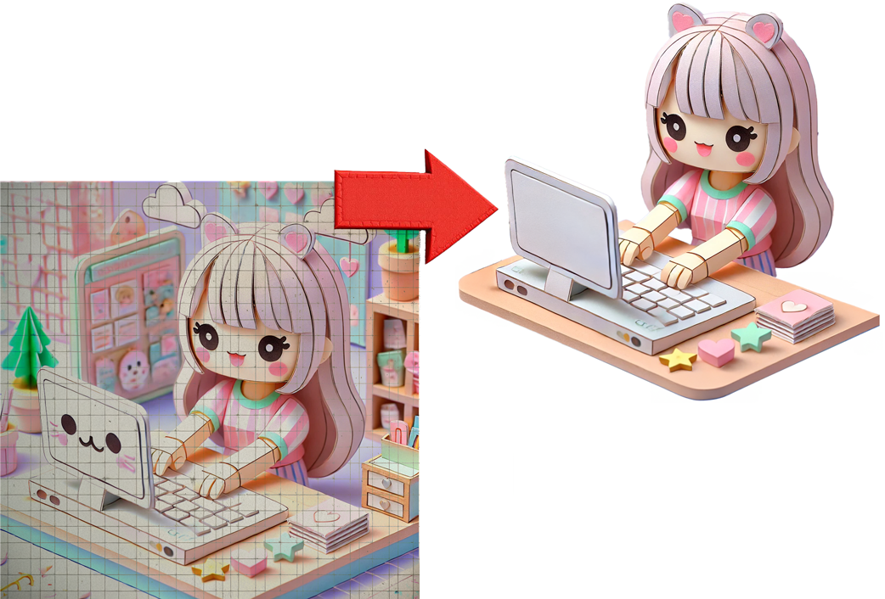

import useBaseUrl from '@docusaurus/useBaseUrl';
import '../apresentacao.css';

# Imagens
  
O ChatGPT possui a "habilidade" de gerar e analisar imagens. Essa ferramenta geralmente identifica, pelo texto do *prompt*, se a solicitação envolve o uso de imagens. No entanto, você pode deixar essa intenção mais clara selecionando a opção "Ferramentas | Retratar" antes de enviar o comando.

## Analisar imagens
Um recurso interessante do ChatGPT é sua capacidade de identificar textos presentes em imagens. Esse recurso abre diversas possibilidades de uso. Vou dar um exemplo, mas antes: você sabe o que é uma "gralha"?

### Gralhas: O Que São?
Se você pensou em um pássaro, acertou! Porém, no contexto editorial, "gralha" se refere a erros tipográficos ou de digitação, como a falta de uma letra ou a inversão de caracteres. No passado, esses erros eram comuns em impressões manuais, quando letras eram organizadas de forma equivocada durante a composição dos textos. Hoje, tais falhas podem surgir durante a digitação, ao copiar e colar trechos entre documentos ou mesmo por descuidos na diagramação. O problema é que, devido à sua sutileza, esses erros podem passar despercebidos durante a revisão final do material.

### Solução?
Quando o conteúdo a ser revisado está em formato de texto, já mostrei [aqui como o ChatGPT pode ajudar](./revisao). Mas e quando o material final é um arquivo de imagem? É aí que entra a capacidade do ChatGPT de identificar textos presentes nas imagens.

Você pode enviar a imagem (botão anexar arquivos) para o ChatGPT e solicitar uma revisão nos textos contidos nela. Veja este *prompt*:
```
Assuma o papel de um revisor experiente e revise os textos presentes na imagem anexada, priorizando os seguintes aspectos: ortografia correta, gramática precisa, pontuação adequada, uso adequado de conectivos e sintaxe correta.
```

:::warning
Fique atento, pois devido à grande variedade de tipos de fontes disponíveis, é possível que a fonte escolhida para a diagramação do texto não seja reconhecida pelo ChatGPT. Portanto, antes de colocar seu prompt em "produção", teste se o ChatGPT consegue identificar as fontes utilizadas pela sua organização.
:::

Seja nos impressos do século passado ou em posts para redes sociais, as "gralhas" continuam aparecendo. Felizmente, com ferramentas como o ChatGPT, é possível revisar textos em imagens e eliminar esses erros antes da publicação.

## Gerar imagens
Iniciei este texto mostrando o uso do ChatGPT para revisão de imagens, algo que considero bastante útil, mas que ainda é pouco explorado nas empresas. O uso mais popular, no entanto, é a geração de imagens. 

O pedido para a geração da imagem é feito por meio de um prompt, que pode variar em complexidade, desde instruções simples até detalhes mais elaborados, dependendo do nível de direcionamento que você deseja aplicar à criação.

Agora, você vai entender por que os textos deste curso são ilustrados com essas imagens "fofas". E lá vou eu aqui novamente... Antes de prosseguirmos, você sabe o que significa *kawaii*?

### *Kawaii*: O Que é?
*Kawaii* (かわいい) é uma palavra japonesa que significa "fofo" ou "adorável". Ela é usada para descrever qualquer coisa que seja charmosa, atraente e meiga, muitas vezes com um apelo infantil ou inocente. O conceito é amplamente difundido na cultura japonesa e influenciou várias áreas, como moda, design, entretenimento e comportamento social.

Menciono o conceito de *kawaii* porque ele será útil para compreender um dos principais elementos no processo de direcionamento da geração de imagens: o estilo. Por meio do estilo, é possível orientar o resultado desejado com poucas palavras. Aqui estão dois exemplos de *prompts* que usei para criar imagens para este material:

```url link='https://chatgpt.com/share/677eed78-eb7c-8003-b2ed-451228551176'
Laptop feito de papel. 3D. Paper-toy. Kawaii.
```
```url link='https://chatgpt.com/share/677eed78-eb7c-8003-b2ed-451228551176'
Mulher digitando teclado notebook. 3D. Paper-toy. Kawaii.
```
Além de especificar os elementos principais da imagem — um laptop no primeiro caso e uma mulher no segundo —, a IA do gerador de imagens compreendeu que o estilo desejado deveria combinar a estética de paper toy (brinquedos de papel criados por meio de dobraduras) com a suavidade e a delicadeza do estilo *kawaii*, resultando em uma composição tridimensional.

Se você estiver atento ao que foi apresentado neste material,poderá notar que há diferenças entre o link que exibe o prompt e as imagens geradas e as versões que incluí aqui. O que fiz foi utilizar o resultado gerado pelo ChatGPT e editá-lo no Photoshop. Essa é minha dica valiosa para quem possui habilidade em edição de imagens.

<center>

</center>

Diferentemente dos exemplos de *prompts* para texto que apresentei anteriormente, o direcionamento para geração de imagens pelo ChatGPT ainda carece de precisão, sendo um processo que envolve muita tentativa e erro até alcançar o resultado desejado, o que pode consumir bastante tempo. Por isso, quando consigo os elementos principais da imagem que desejo, continuo o processo de refinamento no Photoshop ou mesmo no GIMP, uma ferramenta gratuita de edição de imagens.
